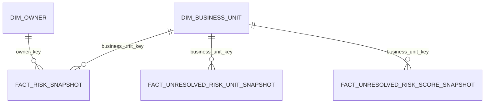

# Fact Tables

## fact_risk_snapshot

**Purpose**  
เก็บสถานะของ Risk แต่ละรายการ ณ source update แต่ละครั้ง และเป็น fact หลักสำหรับการคำนวณ `Risk Priority Score` และ Top Risk Follow-up

**Grain**  
หนึ่งแถวต่อ `risk_id × source update snapshot`

**Primary Key**
- `risk_snapshot_key` — warehouse surrogate key

**Business Key**
- `risk_id`
- `snapshot_at`

**Foreign Keys**
- `business_unit_key`
- `owner_key`

**Columns**

| Column | Description | Source / Derivation |
|---|---|---|
| `risk_snapshot_key` | surrogate PK | warehouse-generated |
| `risk_id` | business identifier ของ Risk | `risk_id` |
| `risk_title` | ชื่อ/รายละเอียด Risk | `risk_title` |
| `business_unit_key` | FK ไป `dim_business_unit` | lookup จาก `business_unit` |
| `owner_key` | FK ไป `dim_owner` | lookup จาก `owner` |
| `likelihood` | likelihood ของ Risk | `likelihood` |
| `impact` | impact ของ Risk | `impact` |
| `status` | lifecycle status | `status` |
| `risk_priority_score` | คะแนนสำหรับจัดลำดับติดตาม | `likelihood × impact` |
| `is_unresolved` | flag ระบุว่ายังไม่ปิดหรือไม่ | `status != 'closed'` |
| `snapshot_at` | เวลา ingest/update snapshot | warehouse-generated |

**Metric Mapping**
- `METRIC-03 — Risk Priority Score`
- `METRIC-05 — Top Risk Follow-up Rank`

**Source System**
- Source ตัวอย่าง: `oab_cyber_risks_2_5mb.csv`
- Production source: `null`

---

## fact_unresolved_risk_unit_snapshot

**Purpose**  
aggregate สำหรับวิเคราะห์การกระจุกตัวของ Unresolved Risk ราย Business Unit

**Grain**  
หนึ่งแถวต่อ `business_unit × source update snapshot`

**Primary Key**
- `unit_snapshot_key`

**Business Key**
- `business_unit_key`
- `snapshot_at`

**Foreign Keys**
- `business_unit_key`

**Columns**

| Column | Description | Derivation |
|---|---|---|
| `unit_snapshot_key` | surrogate PK | warehouse-generated |
| `business_unit_key` | Business Unit | `fact_risk_snapshot.business_unit_key` |
| `unresolved_risk_count` | จำนวน Risk ที่ยังไม่ปิด | count เมื่อ `is_unresolved = true` |
| `total_unresolved_risk_count` | Unresolved Risk รวมทุก Business Unit ของ snapshot เดียวกัน | aggregate |
| `unresolved_risk_share` | สัดส่วนของหน่วยงานต่อ unresolved ทั้งหมด (percentage scale `0–100`) | `100 × unit count / total count` ของ snapshot เดียวกัน |
| `snapshot_at` | snapshot time | warehouse-generated |

**Metric Mapping**
- `METRIC-01 — Unresolved Risk Count`
- `METRIC-02 — Unresolved Risk Share by Business Unit`

**Source System**
- Derived from `fact_risk_snapshot`

---

## fact_unresolved_risk_score_snapshot

**Purpose**  
aggregate จำนวน Unresolved Risk ตาม Business Unit และ `Risk Priority Score`

**Grain**  
หนึ่งแถวต่อ `business_unit × risk_priority_score × source update snapshot`

**Primary Key**
- `unit_score_snapshot_key`

**Business Key**
- `business_unit_key`
- `risk_priority_score`
- `snapshot_at`

**Foreign Keys**
- `business_unit_key`

**Columns**

| Column | Description | Derivation |
|---|---|---|
| `unit_score_snapshot_key` | surrogate PK | warehouse-generated |
| `business_unit_key` | Business Unit | `fact_risk_snapshot.business_unit_key` |
| `risk_priority_score` | Risk Priority Score | จาก risk-level fact |
| `unresolved_risk_count` | จำนวน unresolved Risk ของ score นั้น | aggregate |
| `snapshot_at` | snapshot time | warehouse-generated |

**Metric Mapping**
- `METRIC-04 — Unresolved Risk Count by Priority Score`

**Source System**
- Derived from `fact_risk_snapshot`

---

## snapshot_registry

**Purpose**  
บันทึกสถานะของแต่ละ source update snapshot และเป็นแหล่งเดียวสำหรับเลือก **latest successfully published snapshot** ตาม `DASHBOARD_SPEC.md` Snapshot Rule

**Grain**  
หนึ่งแถวต่อ `snapshot_at`

**Primary Key**
- `snapshot_at`

**Columns**

| Column | Description | Source / Derivation |
|---|---|---|
| `snapshot_at` | snapshot time ที่ตรงกับ `snapshot_at` ใน fact/aggregate ทุกตัว | warehouse-generated (pipeline run) |
| `publication_status` | `building` / `published` / `failed` | pipeline publication gate |
| `pipeline_run_id` | run ที่สร้าง snapshot นี้ | orchestrator metadata |
| `published_at` | เวลาที่ snapshot ผ่าน gate และถูก publish | warehouse-generated; `NULL` ถ้ายังไม่ publish |

**Status Rule**
- pipeline insert แถว `publication_status = 'building'` ตอนเริ่ม run
- เปลี่ยนเป็น `published` ได้เมื่อผ่าน Publication Gate ใน `DATA_QUALITY.md` และ fact/aggregate ทั้ง 3 ตัวของ snapshot เดียวกันสร้างครบเท่านั้น
- run ที่ fail ต้องถูก mark `failed` และห้ามถูกเลือกโดย metric query

**Metric Mapping**
- ทุก metric (`METRIC-01`–`METRIC-05`) ใช้ table นี้เลือก current snapshot

# Dimension Tables

## dim_business_unit

**Purpose**  
เก็บ Business Unit ที่ Risk ถูกบันทึกหรือ assign อยู่

**Primary Key**
- `business_unit_key`

**Business Key**
- `business_unit_name`

**Key Attributes**
- `business_unit_name`

**scd_type**
- `1`

**SCD Rule**
- หาก metadata ของ Business Unit ถูกแก้ไข ให้ใช้ค่าปัจจุบัน
- ประวัติการที่ Risk เคยอยู่ Business Unit ใดถูกเก็บผ่าน `fact_risk_snapshot`

---

## dim_owner

**Purpose**  
เก็บ identifier ของผู้รับผิดชอบ Risk

**Primary Key**
- `owner_key`

**Business Key**
- `owner_id`

**Key Attributes**
- `owner_id`

**scd_type**
- `1`

**SCD Rule**
- ใช้ค่าปัจจุบันของ owner identifier
- การเปลี่ยน owner ของ Risk ในแต่ละ update ถูกเก็บใน `fact_risk_snapshot`

**Note**
- Source ตัวอย่างใช้ค่าเช่น `Owner-30`
- ยังไม่ยืนยันว่า identifier นี้อ้างถึงบุคคลธรรมดา ตำแหน่ง หรือ service/account

# Relationships

## Join Keys

| Parent | Child | Join Key | Cardinality |
|---|---|---|---|
| `dim_business_unit` | `fact_risk_snapshot` | `business_unit_key` | 1:N |
| `dim_owner` | `fact_risk_snapshot` | `owner_key` | 1:N |
| `dim_business_unit` | `fact_unresolved_risk_unit_snapshot` | `business_unit_key` | 1:N |
| `dim_business_unit` | `fact_unresolved_risk_score_snapshot` | `business_unit_key` | 1:N |

## Metric Lineage

| Metric | Primary Table |
|---|---|
| `METRIC-01` | `fact_unresolved_risk_unit_snapshot` |
| `METRIC-02` | `fact_unresolved_risk_unit_snapshot` |
| `METRIC-03` | `fact_risk_snapshot` |
| `METRIC-04` | `fact_unresolved_risk_score_snapshot` |
| `METRIC-05` | `fact_risk_snapshot` |
| `METRIC-06` | `fact_risk_snapshot` |
| `METRIC-07` | `fact_risk_snapshot` |
| `METRIC-08` | `fact_risk_snapshot` |
| Current snapshot selection (ทุก metric) | `snapshot_registry` |

# Grain Definitions

| Table | Grain |
|---|---|
| `fact_risk_snapshot` | `1 risk_id × 1 source update snapshot` |
| `fact_unresolved_risk_unit_snapshot` | `1 business_unit × 1 source update snapshot` |
| `fact_unresolved_risk_score_snapshot` | `1 business_unit × 1 risk_priority_score × 1 source update snapshot` |
| `snapshot_registry` | `1 source update snapshot` |

## Grain Consistency

### METRIC-01
Metric grain:

`1 business_unit × 1 source update snapshot`

ตรงกับ:

`fact_unresolved_risk_unit_snapshot`

### METRIC-02
Metric grain:

`1 business_unit × 1 source update snapshot`

ตรงกับ:

`fact_unresolved_risk_unit_snapshot`

### METRIC-03
Metric grain:

`1 risk_id × 1 source update snapshot`

ตรงกับ:

`fact_risk_snapshot`

### METRIC-04
Metric grain:

`1 business_unit × 1 risk_priority_score × 1 source update snapshot`

ตรงกับ:

`fact_unresolved_risk_score_snapshot`

### METRIC-05
Metric grain:

`1 risk_id × 1 source update snapshot`

ตรงกับ:

`fact_risk_snapshot`

## Aggregation Rules

`fact_risk_snapshot` เป็น fine-grain source ของ semantic layer

จาก:

`risk_id × snapshot`

สามารถ aggregate เป็น:

`business_unit × snapshot`

สำหรับ `METRIC-01` และ `METRIC-02`

และ:

`business_unit × risk_priority_score × snapshot`

สำหรับ `METRIC-04`

ห้าม sum ค่า `unresolved_risk_count` ข้ามหลาย `snapshot_at` โดยตรงเพื่อแสดง current state เพราะจะทำให้ Risk เดียวกันถูกนับหลายครั้ง ต้องเลือก snapshot ที่ต้องการก่อน aggregate

# PDPA Data Classification

เอกสารนี้เป็น owner ของ `pdpa_classification`

ค่าที่ใช้ในโปรเจกต์:

- `public` — ข้อมูลที่เปิดเผยได้
- `internal` — ข้อมูลภายในองค์กร
- `confidential` — ข้อมูลที่ต้องจำกัดการเข้าถึง
- `restricted` — ข้อมูลอ่อนไหวที่ต้องควบคุมสูง

## Classification Matrix

| Table.Column | Contains Personal Data? | pdpa_classification | Handling |
|---|---|---|---|
| `fact_risk_snapshot.risk_id` | No evidence from sample | `internal` | จำกัดการใช้งานภายใน |
| `fact_risk_snapshot.risk_title` | ยังไม่ยืนยัน | `null` | Data Governance ต้องตรวจว่า free-text สามารถมีข้อมูลบุคคลได้หรือไม่ |
| `fact_risk_snapshot.likelihood` | No | `internal` | internal analytics |
| `fact_risk_snapshot.impact` | No | `internal` | internal analytics |
| `fact_risk_snapshot.status` | No | `internal` | internal analytics |
| `fact_risk_snapshot.risk_priority_score` | No | `internal` | internal analytics |
| `dim_business_unit.business_unit_name` | No evidence of personal data | `internal` | internal analytics |
| `dim_owner.owner_id` | ยังไม่ยืนยัน | `null` | Data Governance ต้องยืนยันว่า identifier อ้างถึงบุคคลธรรมดาหรือไม่ |

## Pending PDPA Decisions

### `owner_id`
Source ตัวอย่างแสดง identifier เช่น `Owner-30` แต่จาก source เพียงอย่างเดียวไม่สามารถยืนยันได้ว่าเป็นบุคคลธรรมดา ตำแหน่ง หรือ identifier ประเภทอื่น

- `pdpa_classification`: `null`
- calibration / classification owner: Data Governance

### `risk_title`
เป็น free-text และ source ตัวอย่างปัจจุบันยังไม่แสดงหลักฐานเพียงพอว่ามี Personal Data หรือไม่

- `pdpa_classification`: `null`
- calibration / classification owner: Data Governance

จนกว่า Data Governance จะยืนยัน ห้ามตีความ `owner_id` หรือ `risk_title` ว่าเป็นหรือไม่เป็น Personal Data โดยอัตโนมัติ
