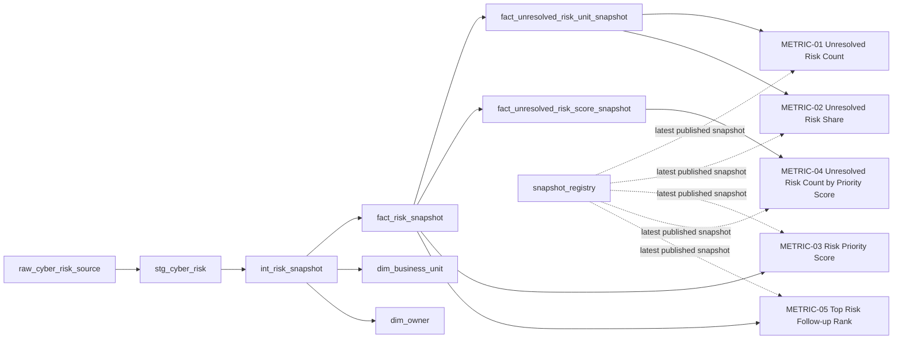

# Metric SQL Implementations

สูตร metric ในเอกสารนี้เป็น canonical technical implementation ของ Project `Client Cyber Risk Dashboard`  
Dashboard และ downstream model ต้องอ้างผลลัพธ์จาก logic นี้ ไม่เขียนสูตรเดียวกันซ้ำแยกต่างหาก

## Common Current-Snapshot Rule

เมื่อ dashboard ต้องแสดงสถานะล่าสุด ให้เลือก **latest successfully published snapshot** จาก `snapshot_registry` (ดู `DATA_MODEL_SPEC.md`) ก่อนคำนวณ metric

ห้ามใช้ `MAX(snapshot_at)` จาก fact/aggregate table โดยตรง เพราะ:

- snapshot ล่าสุดอาจสร้างไม่ครบหรือ quality gate fail
- แต่ละ table อาจมี `MAX(snapshot_at)` ไม่เท่ากันระหว่าง pipeline run ทำให้ chart คนละตัวแสดงคนละ snapshot (ขัด `DA-005`)

```sql
WITH current_snapshot AS (
    SELECT MAX(snapshot_at) AS snapshot_at
    FROM snapshot_registry
    WHERE publication_status = 'published'
)
SELECT snapshot_at
FROM current_snapshot;
```

ทุก metric query ด้านล่างใช้ `current_snapshot` CTE นี้ตัวเดียวกัน ทุก chart บน dashboard view เดียวกันจึงได้ snapshot เดียวกัน

การเลือก snapshot ก่อน aggregate มีความสำคัญเพื่อป้องกัน Risk เดียวกันถูกนับซ้ำข้ามหลาย update

## Common Business Unit Filter Rule

Query ที่รองรับ Business Unit filter ใช้ parameter `:business_unit_key`

- `:business_unit_key IS NULL` = All Business Units
- filter ต้องถูก apply **ก่อน** ranking / aggregate เสมอ

```sql
WHERE (:business_unit_key IS NULL OR f.business_unit_key = :business_unit_key)
```

## Persisted Derived Fields Rule

`is_unresolved` และ `risk_priority_score` ถูก derive ครั้งเดียวที่ `int_risk_snapshot` metric query ทุกตัวต้องอ่าน column ที่ persisted แล้ว ห้ามคำนวณ `likelihood * impact` หรือ `status <> 'closed'` ซ้ำใน metric query

---

## METRIC-01 — Unresolved Risk Count

**source_tables**
- `fact_unresolved_risk_unit_snapshot`
- `snapshot_registry`

**join_logic**
- ไม่มี join ที่จำเป็นสำหรับ metric value
- หากต้องการชื่อหน่วยงานสำหรับ display ให้ join `dim_business_unit` ด้วย `business_unit_key`

**filters**
- latest published `snapshot_at`

**group_by_grain**
- `business_unit × source update snapshot`

```sql
WITH current_snapshot AS (
    SELECT MAX(snapshot_at) AS snapshot_at
    FROM snapshot_registry
    WHERE publication_status = 'published'
)
SELECT
    f.business_unit_key,
    f.snapshot_at,
    f.unresolved_risk_count
FROM fact_unresolved_risk_unit_snapshot AS f
JOIN current_snapshot AS s
    ON f.snapshot_at = s.snapshot_at;
```

### Display with Business Unit Name

```sql
WITH current_snapshot AS (
    SELECT MAX(snapshot_at) AS snapshot_at
    FROM snapshot_registry
    WHERE publication_status = 'published'
)
SELECT
    d.business_unit_name,
    f.snapshot_at,
    f.unresolved_risk_count
FROM fact_unresolved_risk_unit_snapshot AS f
JOIN current_snapshot AS s
    ON f.snapshot_at = s.snapshot_at
JOIN dim_business_unit AS d
    ON f.business_unit_key = d.business_unit_key;
```

---

## METRIC-02 — Unresolved Risk Share by Business Unit

**source_tables**
- `fact_unresolved_risk_unit_snapshot`
- `snapshot_registry`

**join_logic**
- ไม่มี join ที่จำเป็นต่อ calculation
- `dim_business_unit` ใช้เฉพาะ label/display

**filters**
- latest published `snapshot_at`

**group_by_grain**
- `business_unit × source update snapshot`

**unit**
- percentage scale `0–100` (เช่น `26.6073` = 26.6073%) ตรงกับสูตร `× 100` ใน `METRIC_SPEC.md`

`unresolved_risk_share` ถูกคำนวณและ persist ครั้งเดียวตอน build `fact_unresolved_risk_unit_snapshot` (ดู Mart Models ด้านล่าง) query นี้อ่านค่าที่ persisted แล้วเท่านั้น

```sql
WITH current_snapshot AS (
    SELECT MAX(snapshot_at) AS snapshot_at
    FROM snapshot_registry
    WHERE publication_status = 'published'
)
SELECT
    f.business_unit_key,
    f.snapshot_at,
    f.unresolved_risk_count,
    f.total_unresolved_risk_count,
    f.unresolved_risk_share
FROM fact_unresolved_risk_unit_snapshot AS f
JOIN current_snapshot AS s
    ON f.snapshot_at = s.snapshot_at;
```

**Zero-denominator rule**

ถ้า snapshot ไม่มี Unresolved Risk เลย aggregate จะไม่มีแถว (ไม่มี Business Unit ที่ `unresolved_risk_count > 0`) จึงไม่มี division ให้ error ระดับ build ยังคงใช้ guard `CASE WHEN total = 0 THEN 0` เพื่อความปลอดภัย

**Filter Context**

METRIC-02 เป็นสัดส่วนเทียบกับ **ทุก** Business Unit เมื่อ dashboard filter Business Unit ค่า share ของหน่วยงานที่เลือกต้องยังเป็นสัดส่วนต่อ total ทั้งองค์กร (ไม่ re-normalize เป็น 100%)

---

## METRIC-03 — Risk Priority Score

**source_tables**
- `fact_risk_snapshot`
- `snapshot_registry`

**join_logic**
- ไม่มี join สำหรับ calculation

**filters**
- dashboard follow-up view ใช้เฉพาะ `is_unresolved = TRUE`
- latest published `snapshot_at`
- optional `:business_unit_key`

**group_by_grain**
- `risk_id × source update snapshot`
- ไม่มี aggregate

Canonical formula (derive ที่ `int_risk_snapshot` เท่านั้น):

```sql
risk_priority_score = likelihood * impact
```

Implementation — อ่าน persisted column:

```sql
WITH current_snapshot AS (
    SELECT MAX(snapshot_at) AS snapshot_at
    FROM snapshot_registry
    WHERE publication_status = 'published'
)
SELECT
    f.risk_id,
    f.snapshot_at,
    f.likelihood,
    f.impact,
    f.risk_priority_score
FROM fact_risk_snapshot AS f
JOIN current_snapshot AS s
    ON f.snapshot_at = s.snapshot_at
WHERE
    f.is_unresolved = TRUE
    AND (:business_unit_key IS NULL OR f.business_unit_key = :business_unit_key);
```

`risk_priority_score` ที่ persisted ใน `fact_risk_snapshot` ต้องให้ผลเท่ากับ `likelihood × impact` เสมอ (ตรวจโดย `DQ-007`)

---

## METRIC-04 — Unresolved Risk Count by Priority Score

**source_tables**
- `fact_unresolved_risk_score_snapshot`
- `snapshot_registry`

**join_logic**
- join `dim_business_unit` เฉพาะกรณีต้องการชื่อหน่วยงาน

**filters**
- latest published `snapshot_at`

**group_by_grain**
- `business_unit × risk_priority_score × source update snapshot`

```sql
WITH current_snapshot AS (
    SELECT MAX(snapshot_at) AS snapshot_at
    FROM snapshot_registry
    WHERE publication_status = 'published'
)
SELECT
    f.business_unit_key,
    f.risk_priority_score,
    f.snapshot_at,
    f.unresolved_risk_count
FROM fact_unresolved_risk_score_snapshot AS f
JOIN current_snapshot AS s
    ON f.snapshot_at = s.snapshot_at;
```

### Dashboard Dataset

รองรับ All Business Units และ Business Unit filter ด้วย query เดียว

```sql
WITH current_snapshot AS (
    SELECT MAX(snapshot_at) AS snapshot_at
    FROM snapshot_registry
    WHERE publication_status = 'published'
)
SELECT
    f.risk_priority_score,
    SUM(f.unresolved_risk_count) AS unresolved_risk_count
FROM fact_unresolved_risk_score_snapshot AS f
JOIN current_snapshot AS s
    ON f.snapshot_at = s.snapshot_at
WHERE (:business_unit_key IS NULL OR f.business_unit_key = :business_unit_key)
GROUP BY f.risk_priority_score
ORDER BY f.risk_priority_score DESC;
```

`SUM` ข้าม Business Unit ภายใน snapshot เดียวกันปลอดภัย เพราะแต่ละ Risk อยู่ใน Business Unit เดียวต่อ snapshot

Dashboard version ปัจจุบันใช้ `risk_priority_score` โดยตรงเป็นระดับคะแนนความเสี่ยง ยังไม่มี `Low / Medium / High / Critical` bucket

---

## METRIC-05 — Top Risk Follow-up Rank

**source_tables**
- `fact_risk_snapshot`
- `dim_owner`
- `dim_business_unit`
- `snapshot_registry`

**join_logic**
- `fact_risk_snapshot.owner_key = dim_owner.owner_key`
- `fact_risk_snapshot.business_unit_key = dim_business_unit.business_unit_key`

**filters**
- `is_unresolved = TRUE`
- `risk_priority_score IS NOT NULL` — Risk ที่ score เป็น NULL ห้ามเข้า ranking
- latest published `snapshot_at`
- optional `:business_unit_key` — apply **ก่อน** ranking

**group_by_grain**
- `risk_id × source update snapshot`

**ranking**
1. `risk_priority_score DESC`
2. `risk_id ASC` เป็น deterministic technical tie-break
3. แสดง rank 1–3

Canonical sequence (ตรงกับ `DASHBOARD_SPEC.md` Drill-down Path 2):

```text
filter unresolved risks
→ filter business_unit (ถ้ามี)
→ exclude NULL risk_priority_score
→ rank
→ select Top 3
```

```sql
WITH current_snapshot AS (
    SELECT MAX(snapshot_at) AS snapshot_at
    FROM snapshot_registry
    WHERE publication_status = 'published'
),
ranked_risks AS (
    SELECT
        f.risk_id,
        f.risk_title,
        f.risk_priority_score,
        f.likelihood,
        f.impact,
        d.business_unit_name,
        o.owner_id,
        f.snapshot_at,
        ROW_NUMBER() OVER (
            ORDER BY
                f.risk_priority_score DESC,
                f.risk_id ASC
        ) AS follow_up_rank
    FROM fact_risk_snapshot AS f
    JOIN current_snapshot AS s
        ON f.snapshot_at = s.snapshot_at
    LEFT JOIN dim_business_unit AS d
        ON f.business_unit_key = d.business_unit_key
    LEFT JOIN dim_owner AS o
        ON f.owner_key = o.owner_key
    WHERE
        f.is_unresolved = TRUE
        AND f.risk_priority_score IS NOT NULL
        AND (:business_unit_key IS NULL OR f.business_unit_key = :business_unit_key)
)
SELECT
    follow_up_rank,
    risk_id,
    risk_title,
    risk_priority_score,
    owner_id,
    business_unit_name
FROM ranked_risks
WHERE follow_up_rank <= 3
ORDER BY follow_up_rank;
```

`risk_priority_score IS NOT NULL` จำเป็นเพราะหลาย warehouse (เช่น PostgreSQL, Snowflake) เรียง `NULL` ไว้ก่อนเมื่อใช้ `DESC` หากไม่ exclude Risk ที่ไม่มี score จะขึ้นเป็นอันดับ 1

`risk_id ASC` ใช้เพียงเพื่อให้ผลลัพธ์ deterministic เมื่อ score เท่ากัน ไม่ได้แสดงว่า Risk ใดมี business priority สูงกว่าอีก Risk หนึ่งเมื่อคะแนนเท่ากัน

**Observed tie volume (sample fixture)**

ใน `oab_cyber_risks_2_5mb.csv` มี Unresolved Risk ที่ score = 25 จำนวน 471 รายการ ดังนั้น Top 3 ถูกตัดสินด้วย technical tie-break ทั้งหมด ไม่ใช่ business priority — management ต้องรับทราบข้อจำกัดนี้ และหากต้องการ secondary business rule ต้องอนุมัติผ่าน `BUSINESS_GLOSSARY.md`

## METRIC-06 / METRIC-07 — Closed Risk Ratio, Not Started Share

**source_tables**
- `fact_risk_snapshot`
- `dim_business_unit`
- `snapshot_registry`

**why risk-level fact, not `fact_unresolved_risk_unit_snapshot`**  
aggregate ตัวนั้นมีแถวเฉพาะ Business Unit ที่ `unresolved_risk_count > 0` หน่วยงานที่ปิดครบแล้ว (100% closed) จะหายไป

**filters**
- latest published `snapshot_at`
- `is_unresolved IS NOT NULL`

**group_by_grain**
- `business_unit × source update snapshot`

```sql
WITH current_snapshot AS (
    SELECT MAX(snapshot_at) AS snapshot_at
    FROM snapshot_registry
    WHERE publication_status = 'published'
),
counts AS (
    SELECT
        d.business_unit_key,
        d.business_unit_name,
        COUNT(*) AS total_risk_count,
        COUNT(*) FILTER (WHERE f.is_unresolved = FALSE) AS closed_risk_count,
        COUNT(*) FILTER (WHERE f.is_unresolved = TRUE) AS unresolved_risk_count,
        COUNT(*) FILTER (WHERE f.is_unresolved = TRUE AND f.status = 'open')
            AS not_started_risk_count
    FROM fact_risk_snapshot AS f
    JOIN current_snapshot AS s ON f.snapshot_at = s.snapshot_at
    JOIN dim_business_unit AS d ON f.business_unit_key = d.business_unit_key
    WHERE f.is_unresolved IS NOT NULL
    GROUP BY d.business_unit_key, d.business_unit_name
)
SELECT
    *,
    100.0 * closed_risk_count / total_risk_count AS closed_risk_ratio,
    CASE
        WHEN unresolved_risk_count = 0 THEN NULL
        ELSE 100.0 * not_started_risk_count / unresolved_risk_count
    END AS not_started_share
FROM counts;
```

ทั้งสอง metric แสดงทุก Business Unit เสมอ (เปรียบเทียบข้ามหน่วยงาน) Business Unit filter ใช้เพื่อ highlight เท่านั้น

---

## METRIC-08 — Unresolved Risk Matrix

**source_tables**
- `fact_risk_snapshot`
- `snapshot_registry`

**filters**
- `is_unresolved = TRUE`
- latest published `snapshot_at`
- optional `:business_unit_key`

**group_by_grain**
- `likelihood × impact × source update snapshot`

Axis = ค่าที่พบใน snapshot ปัจจุบัน (ทุก Business Unit) cross join กันเพื่อให้ได้ตารางครบทุกช่อง ช่องที่ไม่มี Risk = 0

```sql
WITH current_snapshot AS (
    SELECT MAX(snapshot_at) AS snapshot_at
    FROM snapshot_registry
    WHERE publication_status = 'published'
),
snap AS (
    SELECT f.*
    FROM fact_risk_snapshot AS f
    JOIN current_snapshot AS s ON f.snapshot_at = s.snapshot_at
),
axes AS (
    SELECT l.likelihood, i.impact
    FROM (SELECT DISTINCT likelihood FROM snap WHERE likelihood IS NOT NULL) AS l
    CROSS JOIN (SELECT DISTINCT impact FROM snap WHERE impact IS NOT NULL) AS i
),
cells AS (
    SELECT f.likelihood, f.impact, COUNT(*) AS unresolved_risk_count
    FROM snap AS f
    WHERE
        f.is_unresolved = TRUE
        AND (:business_unit_key IS NULL OR f.business_unit_key = :business_unit_key)
    GROUP BY f.likelihood, f.impact
)
SELECT
    a.likelihood,
    a.impact,
    a.likelihood * a.impact AS risk_priority_score,
    COALESCE(c.unresolved_risk_count, 0) AS unresolved_risk_count
FROM axes AS a
LEFT JOIN cells AS c USING (likelihood, impact)
ORDER BY a.likelihood DESC, a.impact;
```

`risk_priority_score` ในผลลัพธ์นี้เป็นค่า label ของช่อง (axis value × axis value) ไม่ใช่การคำนวณ score ของ Risk record ใหม่ — score ระดับ record ยังมาจาก `int_risk_snapshot` เท่านั้น

# Edge Case Handling

## Null / Missing Values

### `risk_id IS NULL`

Risk ที่ไม่มี `risk_id` ไม่สามารถรักษา grain `1 risk_id × snapshot` ได้ จึงไม่ควรเข้าสู่ semantic fact

```sql
SELECT *
FROM stg_cyber_risk
WHERE risk_id IS NULL;
```

records เหล่านี้ต้องถูก quarantine โดย pipeline/data-quality process ไม่ใช่สร้าง identifier สมมติขึ้นเอง

### `status IS NULL`

ห้ามตีความ `NULL` ว่าเป็น unresolved อัตโนมัติ เพราะ business rule ที่อนุมัติคือ `status != 'closed'`

Canonical flag:

```sql
CASE
    WHEN status IS NULL THEN NULL
    WHEN status <> 'closed' THEN TRUE
    ELSE FALSE
END AS is_unresolved
```

ดังนั้น records ที่ `status IS NULL` ต้องไม่ถูกนับเข้า numerator จนกว่าจะผ่าน data-quality resolution

### `likelihood` หรือ `impact` เป็น NULL

ห้ามเปลี่ยน NULL เป็น 0 เพราะจะสร้าง Risk Priority Score ที่ดู valid ทั้งที่ input หาย

```sql
CASE
    WHEN likelihood IS NULL OR impact IS NULL THEN NULL
    ELSE likelihood * impact
END AS risk_priority_score
```

Risk ที่ score เป็น NULL ไม่ควรเข้าสู่ Top 3 ranking

```sql
WHERE
    is_unresolved = TRUE
    AND risk_priority_score IS NOT NULL
```

### `business_unit` เป็น NULL

record ยังอาจอยู่ใน `fact_risk_snapshot` ได้ แต่ไม่ควรถูก silently map ไป Business Unit ที่มีอยู่

ใช้ unknown-key handling ที่ pipeline กำหนด หรือ quarantine ตาม DATA_QUALITY.md ในขั้น downstream

ห้ามนับ NULL business unit เข้า Business Unit จริงโดยการ `COALESCE` เป็นชื่อหน่วยงานใดหน่วยงานหนึ่ง

---

## Duplicate Risk in the Same Snapshot

grain กำหนดว่าใน snapshot เดียวต้องมี Risk หนึ่งแถวต่อ `risk_id`

ตรวจ duplicate:

```sql
SELECT
    risk_id,
    snapshot_at,
    COUNT(*) AS row_count
FROM fact_risk_snapshot
GROUP BY
    risk_id,
    snapshot_at
HAVING COUNT(*) > 1;
```

ผลลัพธ์ต้องไม่มีแถวก่อนใช้ metric เพื่อป้องกัน double counting

---

## Mid-month Churn

**Not applicable**

Project นี้ไม่มี customer subscription, churn date หรือ monthly revenue metric

SQL metric ทั้ง 5 ตัวจึงไม่มี churn branch และห้ามนำ churn/proration logic มาเปลี่ยน Risk counts

หาก schema ในอนาคตเพิ่ม subscription metric ต้องเพิ่ม metric definition ใหม่ก่อน ไม่ reuse logic ในเอกสารนี้

---

## Proration

**Not applicable**

ไม่มี plan, billing period หรือ prorated monetary metric ใน scope ปัจจุบัน

Metric implementation จึงไม่ทำ multiplication ด้วย day fraction หรือ period fraction ใด ๆ

---

## Currency Conversion

**Not applicable**

Metric ทั้งหมดเป็น count, share, score และ rank ไม่มี monetary field หรือ currency dimension

ดังนั้นไม่มี FX conversion ใน calculation path ปัจจุบัน

หากภายหลังมี financial exposure เพิ่มเข้ามา ต้องกำหนด metric ใหม่และ conversion rule ใหม่ก่อนใช้งาน

---

## Backdated / Late-Arriving Records

Source ไม่มี business-effective timestamp ที่ยืนยันแล้ว มีเพียง warehouse-generated `snapshot_at`

ดังนั้น version ปัจจุบันใช้หลัก:

**record มีผลต่อ snapshot ที่มันถูก ingest เข้ามาเท่านั้น**

ห้ามนำ record ย้อนกลับไปแก้ snapshot ก่อนหน้าโดยอัตโนมัติ

Current-state calculation:

```sql
SELECT MAX(snapshot_at)
FROM snapshot_registry
WHERE publication_status = 'published';
```

historical snapshots ที่เคยเผยแพร่แล้วจะไม่ถูก restate จนกว่าจะมี explicit restatement decision

**restatement_policy:** `null`  
**decision_owner:** management / Data Governance

หากภายหลัง source ส่ง `effective_at` หรือ equivalent field ต้องทบทวน policy นี้ก่อนเปลี่ยน logic

---

## Restatement Policy

ตอนนี้ไม่มี approved policy สำหรับแก้ metric ที่เคยรายงานย้อนหลัง

ดังนั้น:

```text
historical restatement = disabled by default
restatement approval = required
approval owner = management / Data Governance
```

เมื่อมีการอนุมัติ restatement จริง ต้องบันทึก effective date และการเปลี่ยนนิยามใน `ANALYTICS_CHANGELOG.md`

# Transformation Dependencies

## Model DAG



## Staging Models

### `stg_cyber_risk`

**input**
- raw production source: `null`
- development/sample source: `oab_cyber_risks_2_5mb.csv`

**responsibility**
- normalize column names/types
- preserve source values
- expose malformed/null records for quality checks
- ไม่คำนวณ metric

**materialization**
- `view`

---

## Intermediate Models

### `int_risk_snapshot`

**input**
- `stg_cyber_risk`

**responsibility**
- attach warehouse-generated `snapshot_at`
- resolve dimension keys
- derive canonical business fields:

```sql
CASE
    WHEN status IS NULL THEN NULL
    WHEN status <> 'closed' THEN TRUE
    ELSE FALSE
END AS is_unresolved
```

```sql
CASE
    WHEN likelihood IS NULL OR impact IS NULL THEN NULL
    ELSE likelihood * impact
END AS risk_priority_score
```

**materialization**
- `view`

---

## Mart Models

### `fact_risk_snapshot`

**input**
- `int_risk_snapshot`

**grain**
- `risk_id × source update snapshot`

**materialization**
- `incremental`

**idempotent key**
- `risk_id`
- `snapshot_at`

---

### `fact_unresolved_risk_unit_snapshot`

**input**
- `fact_risk_snapshot`

**grain**
- `business_unit × source update snapshot`

Canonical aggregate:

```sql
WITH unit_counts AS (
    SELECT
        business_unit_key,
        snapshot_at,
        COUNT(*) AS unresolved_risk_count
    FROM fact_risk_snapshot
    WHERE is_unresolved = TRUE
    GROUP BY
        business_unit_key,
        snapshot_at
)
SELECT
    business_unit_key,
    snapshot_at,
    unresolved_risk_count,
    SUM(unresolved_risk_count) OVER (PARTITION BY snapshot_at)
        AS total_unresolved_risk_count,
    CASE
        WHEN SUM(unresolved_risk_count) OVER (PARTITION BY snapshot_at) = 0 THEN 0
        ELSE
            100.0 * unresolved_risk_count
            / SUM(unresolved_risk_count) OVER (PARTITION BY snapshot_at)
    END AS unresolved_risk_share
FROM unit_counts;
```

`total_unresolved_risk_count` และ `unresolved_risk_share` ต้องคำนวณจาก snapshot เดียวกันเท่านั้น (`PARTITION BY snapshot_at`)

`unresolved_risk_share` ใช้ percentage scale `0–100` และนี่คือจุดเดียวที่คำนวณ share — METRIC-02 และ dashboard อ่านค่าที่ persisted

**materialization**
- `table`

---

### `fact_unresolved_risk_score_snapshot`

**input**
- `fact_risk_snapshot`

**grain**
- `business_unit × risk_priority_score × source update snapshot`

```sql
SELECT
    business_unit_key,
    risk_priority_score,
    snapshot_at,
    COUNT(*) AS unresolved_risk_count
FROM fact_risk_snapshot
WHERE
    is_unresolved = TRUE
    AND risk_priority_score IS NOT NULL
GROUP BY
    business_unit_key,
    risk_priority_score,
    snapshot_at;
```

**materialization**
- `table`

---

## Dependency Matrix

| Model | Depends On | Output Purpose |
|---|---|---|
| `stg_cyber_risk` | raw source | Clean source interface |
| `int_risk_snapshot` | `stg_cyber_risk` | Canonical business logic |
| `fact_risk_snapshot` | `int_risk_snapshot` | Risk-level semantic fact |
| `dim_business_unit` | `int_risk_snapshot` | Business Unit dimension |
| `dim_owner` | `int_risk_snapshot` | Owner dimension |
| `fact_unresolved_risk_unit_snapshot` | `fact_risk_snapshot` | METRIC-01, METRIC-02 |
| `fact_unresolved_risk_score_snapshot` | `fact_risk_snapshot` | METRIC-04 |
| Top-risk dataset | `fact_risk_snapshot`, dimensions | METRIC-05 |
| `snapshot_registry` | pipeline run + publication gate | latest published snapshot สำหรับทุก metric query |
| Status / matrix datasets | `fact_risk_snapshot`, `dim_business_unit` | METRIC-06, METRIC-07, METRIC-08 |

สูตร `Unresolved Risk` และ `Risk Priority Score` ต้องถูก derive ที่ transformation layer นี้เพียงแห่งเดียว ไม่ให้ dashboard คำนวณสูตรแยกเอง
