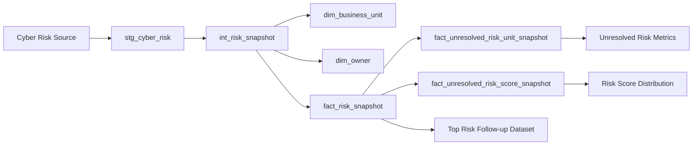

# Pipeline Overview

Project `Client Cyber Risk Dashboard` ใช้ pipeline เพื่อรับ Cyber Risk source แล้วสร้าง semantic datasets สำหรับ KPI `Unresolved Cyber Risk Exposure`

Pipeline ต้องผลิต dataset ทุกตัวที่กำหนดใน `DATA_MODEL_SPEC.md`:

- `dim_business_unit`
- `dim_owner`
- `fact_risk_snapshot`
- `fact_unresolved_risk_unit_snapshot`
- `fact_unresolved_risk_score_snapshot`

และต้องใช้ business/transformation logic จาก `METRIC_LOGIC.md` โดยเฉพาะ:

`Unresolved Risk = status != 'closed'`

`Risk Priority Score = likelihood × impact`

## Pipeline DAG



## Platform Decisions

| Item | Current Value | Decision Owner |
|---|---|---|
| Production source | `null` | source-system owner |
| Warehouse | `null` | Data Engineering / project owner |
| Transform tool | `null` | Data Engineering |
| Orchestrator | `null` | Data Engineering |
| BI destination | `null` | Analytics / project owner |
| Production schedule | `null` | Data Engineering + management |

Business expectation คือข้อมูลต้องพร้อมหลัง source update “ทันที” แต่ยังไม่ถือเป็น technical schedule หรือ freshness SLA จนกว่าจะ calibrate จาก capability ของ source และ pipeline

# Pipeline Definitions

## PIPELINE-01 — Cyber Risk Ingestion

**Purpose**  
นำ Cyber Risk source เข้าสู่ staging layer โดยรักษาค่า source และตรวจ schema shape ก่อน transform

**Source**
- Production: `null`
- Development/sample: `oab_cyber_risks_2_5mb.csv`

**Destination**
- `stg_cyber_risk`

**Transform Tool**
- `null`
- Owner: Data Engineering

**Transformation**
- normalize field names/types ตาม `DATA_CONTRACT.md`
- ไม่คำนวณ business metrics
- preserve source values สำหรับ investigation

**Schedule (cron)**
- `null`
- Calibration basis: source update mechanism/cadence
- Owner: Data Engineering + source-system owner

**Dependencies**
- source availability
- schema compatibility กับ `DATA_CONTRACT.md`

**Output Fields Required**
- `risk_id`
- `business_unit`
- `risk_title`
- `likelihood`
- `impact`
- `status`
- `owner`

---

## PIPELINE-02 — Risk Semantic Transformation

**Purpose**  
สร้าง canonical risk-level transformation ตาม `METRIC_LOGIC.md`

**Source**
- `stg_cyber_risk`

**Destination**
- `int_risk_snapshot`

**Transform Tool**
- `null`
- Owner: Data Engineering

**Transformation**

สร้าง:

```sql
CASE
    WHEN status IS NULL THEN NULL
    WHEN status <> 'closed' THEN TRUE
    ELSE FALSE
END AS is_unresolved
```

และ:

```sql
CASE
    WHEN likelihood IS NULL OR impact IS NULL THEN NULL
    ELSE likelihood * impact
END AS risk_priority_score
```

พร้อมสร้าง warehouse metadata:

- `snapshot_at`

**Schedule (cron)**
- `null`
- ต้องรันหลัง `PIPELINE-01`
- Owner: Data Engineering

**Dependencies**
- `PIPELINE-01`
- successful staging ingestion

---

## PIPELINE-03 — Dimension Build

**Purpose**  
สร้าง dimensions สำหรับ Business Unit และ Risk Owner

**Source**
- `int_risk_snapshot`

**Destinations**
- `dim_business_unit`
- `dim_owner`

**Transform Tool**
- `null`

**Schedule (cron)**
- `null`
- ต้องรันหลัง `PIPELINE-02`

**Dependencies**
- `PIPELINE-02`

**Expected Behavior**
- resolve `business_unit_key`
- resolve `owner_key`
- รักษา business key ตาม `DATA_MODEL_SPEC.md`
- ไม่เปลี่ยน SCD semantics ที่กำหนดใน `DATA_MODEL_SPEC.md`

---

## PIPELINE-04 — Risk Snapshot Fact Build

**Purpose**  
สร้าง semantic fact ระดับ Risk สำหรับ metric และ Top 3 follow-up

**Source**
- `int_risk_snapshot`
- `dim_business_unit`
- `dim_owner`

**Destination**
- `fact_risk_snapshot`

**Grain**
- `risk_id × source update snapshot`

**Transform Tool**
- `null`

**Schedule (cron)**
- `null`
- ต้องรันหลัง `PIPELINE-02` และ `PIPELINE-03`

**Dependencies**
- `PIPELINE-02`
- `PIPELINE-03`

**Required Derived Fields**
- `is_unresolved`
- `risk_priority_score`
- `snapshot_at`

**Idempotent Key**
- `risk_id`
- `snapshot_at`

---

## PIPELINE-05 — Business Unit Aggregate Build

**Purpose**  
สร้าง aggregate สำหรับ:

- `METRIC-01 — Unresolved Risk Count`
- `METRIC-02 — Unresolved Risk Share by Business Unit`

**Source**
- `fact_risk_snapshot`

**Destination**
- `fact_unresolved_risk_unit_snapshot`

**Grain**
- `business_unit × source update snapshot`

**Transform Tool**
- `null`

**Schedule (cron)**
- `null`
- ต้องรันหลัง `PIPELINE-04`

**Dependencies**
- `PIPELINE-04`

**Core Filter**
- `is_unresolved = TRUE`

---

## PIPELINE-06 — Priority Score Aggregate Build

**Purpose**  
สร้าง aggregate สำหรับ:

`METRIC-04 — Unresolved Risk Count by Priority Score`

**Source**
- `fact_risk_snapshot`

**Destination**
- `fact_unresolved_risk_score_snapshot`

**Grain**
- `business_unit × risk_priority_score × source update snapshot`

**Transform Tool**
- `null`

**Schedule (cron)**
- `null`
- ต้องรันหลัง `PIPELINE-04`

**Dependencies**
- `PIPELINE-04`

**Core Filters**
- `is_unresolved = TRUE`
- `risk_priority_score IS NOT NULL`

---

## Execution Order

```text
PIPELINE-01
    ↓
PIPELINE-02
    ↓
PIPELINE-03
    ↓
PIPELINE-04
    ├── PIPELINE-05
    └── PIPELINE-06
```

`PIPELINE-05` และ `PIPELINE-06` สามารถรัน parallel ได้หลัง `PIPELINE-04` สำเร็จ

# Source Systems

## Production Source

| Attribute | Value |
|---|---|
| Source system | `null` |
| Source owner | `null` |
| Source type | `null` |
| Extraction method | `null` |
| Contract | `DATA_CONTRACT.md` |
| Update cadence | `null` |

Calibration / decision owner:
- source-system owner
- Data Engineering

## Development Source

`oab_cyber_risks_2_5mb.csv`

ใช้เป็น source ตัวอย่างในการออกแบบและ validate logic เท่านั้น ไม่ถือเป็น production source

Observed fields:

- `risk_id`
- `business_unit`
- `risk_title`
- `likelihood`
- `impact`
- `status`
- `owner`

## Schema Drift Detection

ก่อน load เข้า semantic layer pipeline ต้องเปรียบเทียบ incoming schema กับ `DATA_CONTRACT.md`

ต้องตรวจอย่างน้อย:

- required field หาย
- field name เปลี่ยน
- data type เปลี่ยน
- unexpected structural change

เมื่อพบ schema drift ที่ทำให้ contract ไม่ compatible:

- ห้าม silently cast เพื่อซ่อน breaking change
- ห้าม load ข้อมูลชุดใหม่เข้า semantic tables
- แยกข้อมูล/metadata สำหรับ investigation
- แจ้ง source-system owner และ Data Engineering
- บันทึกเหตุการณ์สำหรับ reconcile กับ `RUNBOOK.md` และ `ANALYTICS_CHANGELOG.md` ภายหลัง

รายละเอียดของ executable quality assertion จะอยู่ใน `DATA_QUALITY.md`

# Error Handling and Retry

Error handling แยกเป็น **Transient Error** และ **Permanent Error** เพราะ retry เหมาะกับ error ชั่วคราว แต่ไม่แก้ schema, credential หรือ malformed-data error

## Transient Errors

ตัวอย่าง:

- temporary network timeout
- temporary source unavailable
- warehouse connection interruption
- rate limiting หาก production source ภายหลังเป็น API

**Retry Policy**
- retry count: `null`
- retry interval/backoff: `null`
- calibration owner: Data Engineering
- calibration source: production runtime measurements และ platform limits

เมื่อ retry สำเร็จ pipeline ต้องให้ผลแบบ idempotent

## Permanent Errors

ตัวอย่าง:

- schema ไม่ตรง `DATA_CONTRACT.md`
- required column หาย
- incompatible data type
- malformed input ที่ทำให้ grain รักษาไม่ได้
- credential invalid/expired

**Response**
1. หยุด stage ที่ได้รับผลกระทบ
2. ไม่ publish semantic dataset ใหม่
3. เก็บ failed run metadata
4. แจ้ง responsible owner
5. รักษา last successful dataset สำหรับ downstream ตาม operational policy ที่จะกำหนดใน `RUNBOOK.md`

## Authentication Failure

Auth failure ไม่ถือเป็น transient error โดยอัตโนมัติ

เมื่อเกิด:
- alert ทันที
- ไม่รอ retry loop จนครบก่อนแจ้ง
- ตรวจ secret/permission/rotation state

## Duplicate Protection

`fact_risk_snapshot` ต้อง unique ที่:

`risk_id × snapshot_at`

การ rerun pipeline ของ snapshot เดิมต้องไม่เพิ่ม duplicate rows

## Intended RUNBOOK Scenarios

เมื่อสร้าง `RUNBOOK.md` ภายหลัง ต้องมี scenario อย่างน้อยสำหรับ:

- source unavailable
- schema drift
- malformed required field
- duplicate grain
- transformation failure
- credential/authentication failure
- partial aggregate build failure

# Credentials & Secret Management

ห้ามมี credential value, API key, password หรือ token อยู่ใน repository หรือในเอกสารนี้

## Connection Inventory

| Connection | Service Identity | Secret Store | Read Access | Rotation Cadence |
|---|---|---|---|---|
| Production source | dedicated pipeline service identity | `null` | `null` | `null` |
| Warehouse | dedicated pipeline service identity | `null` | `null` | `null` |
| BI / downstream connection | dedicated service identity | `null` | `null` | `null` |

**Calibration / decision owner**
- Secret store: Platform / Security
- Environment access: Platform / Security
- Rotation cadence: Security / Platform

## Least Privilege Rules

- หนึ่ง pipeline/service integration ต้องใช้ service identity ที่ระบุชัด
- source identity มีเฉพาะ permission ที่จำเป็นต่อ extraction
- transform identity มีเฉพาะ permission สำหรับ input/output datasets ที่เกี่ยวข้อง
- BI identity เป็น read-only ต่อ published analytics datasets เว้นแต่ platform requirement ระบุอย่างอื่น
- production credentials ต้องแยกจาก development credentials

## Repository Rule

```text
No credentials committed to repository.
```

รวมถึง:
- password
- API token
- private key
- connection string ที่มี secret
- service-account credential material

# Load Strategy

## PIPELINE-01 — Source Ingestion

**Strategy**
- `null`

ยังไม่สามารถตัดสินว่าเป็น full refresh, incremental, API pull หรือ event-driven ingest จนกว่าจะทราบ production source

**Watermark / Cursor**
- `null`

**Backfill Window**
- `null`

**Calibration Owner**
- Data Engineering + source-system owner

---

## PIPELINE-02 — Intermediate Transformation

Transformation ต้องสร้างผลลัพธ์ deterministic จาก source snapshot เดียวกัน

rerun source snapshot เดิมต้องให้:

- `is_unresolved` เท่าเดิมเมื่อ input เท่าเดิม
- `risk_priority_score` เท่าเดิมเมื่อ input เท่าเดิม

---

## PIPELINE-03 — Dimensions

**Load Strategy**
- upsert ตาม business key

### `dim_business_unit`
business key:

`business_unit_name`

### `dim_owner`
business key:

`owner_id`

SCD handling ต้องเป็นไปตาม `DATA_MODEL_SPEC.md` และ pipeline นี้ห้ามประกาศ SCD definition ใหม่

---

## PIPELINE-04 — fact_risk_snapshot

**Load Strategy**
- incremental snapshot

**Upsert / Idempotent Key**

`risk_id × snapshot_at`

pipeline ต้องสามารถ rerun snapshot เดิมโดยไม่เพิ่ม row count ซ้ำ

**Watermark**
- `snapshot_at`

หมายเหตุ: `snapshot_at` เป็น ingestion metadata ของ analytics layer ไม่ใช่ business-effective timestamp

**Backfill Window**
- `null`

**Calibration Owner**
- Data Engineering

---

## PIPELINE-05 — fact_unresolved_risk_unit_snapshot

**Load Strategy**
- rebuild เฉพาะ snapshot ที่กำลัง process

**Idempotent Key**

`business_unit_key × snapshot_at`

ก่อน publish snapshot เดิม ต้อง replace/upsert aggregate ของ snapshot นั้นแทนการ append ซ้ำ

---

## PIPELINE-06 — fact_unresolved_risk_score_snapshot

**Load Strategy**
- rebuild เฉพาะ snapshot ที่กำลัง process

**Idempotent Key**

`business_unit_key × risk_priority_score × snapshot_at`

ก่อน publish snapshot เดิม ต้อง replace/upsert aggregate ของ snapshot นั้นแทนการ append ซ้ำ

---

## Backfill Policy

ค่าต่อไปนี้ยังไม่ได้ calibrate:

- maximum backfill window: `null`
- historical restatement behavior: `null`

**Decision Owner**
- Data Engineering
- management / Data Governance สำหรับ historical restatement

การ backfill ที่แก้ตัวเลขซึ่งเคย report ไปแล้วต้อง reconcile กับ `ANALYTICS_CHANGELOG.md` เมื่อเอกสารนั้นถูกสร้าง

## Publication Rule

dataset ใหม่ถือว่าพร้อมให้ dashboard ใช้เมื่อ pipeline ของ snapshot เดียวกันสำเร็จครบ:

1. `fact_risk_snapshot`
2. `fact_unresolved_risk_unit_snapshot`
3. `fact_unresolved_risk_score_snapshot`

ห้าม publish aggregate บางตัวจาก snapshot ใหม่ร่วมกับ fact/aggregate ตัวอื่นจาก snapshot เก่า เพราะจะทำให้ dashboard แสดงข้อมูลคนละเวลา

## Snapshot Registry

Publication state ถูกบันทึกใน `snapshot_registry` (ดู `DATA_MODEL_SPEC.md`):

1. เริ่ม run → insert `snapshot_at` พร้อม `publication_status = 'building'`
2. `PIPELINE-01` ถึง `PIPELINE-06` สำเร็จ และ Publication Gate ใน `DATA_QUALITY.md` ผ่าน → update เป็น `published` พร้อม `published_at`
3. stage ใด fail หรือ blocking rule fail → update เป็น `failed`

Metric query และ dashboard เลือก snapshot จาก `snapshot_registry WHERE publication_status = 'published'` เท่านั้น ดังนั้น snapshot ที่ `building` หรือ `failed` จะไม่ถูกแสดง และ last published snapshot ยังคงถูกใช้ต่อ
